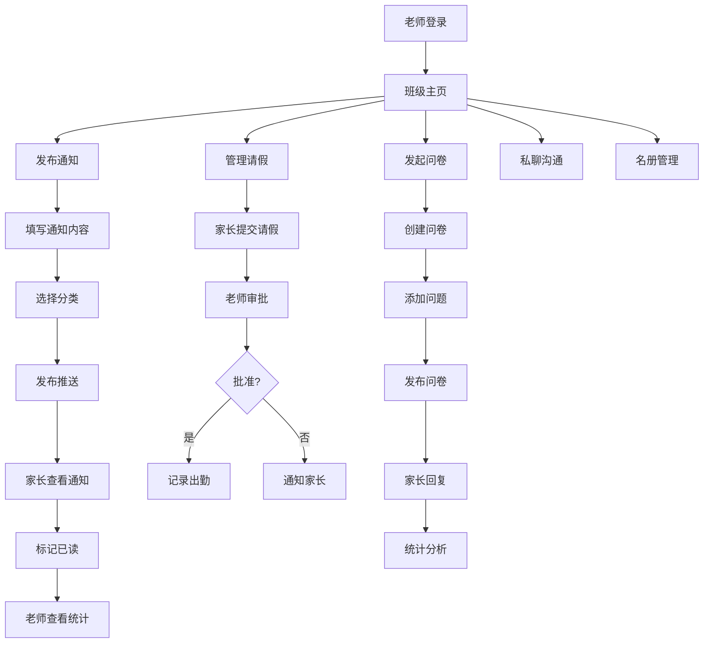

## 1. 产品概述

家校沟通与班级管理平台是一款专为中小学老师设计的数字化管理工具，致力于解决老师与家长之间信息传递不及时、沟通效率低下、班级管理事务繁杂等痛点。通过整合通知发布、请假管理、问卷调研、私密沟通、名册管理等核心功能，实现家校协同教育的无缝对接。

- 主要解决：老师通知传达难追踪、家长反馈难收集、请假出勤管理繁琐、多渠道沟通信息分散等问题
- 目标用户：中小学班主任、任课老师、学生家长
- 市场价值：提升家校沟通效率300%，减少老师行政事务时间50%，构建透明、高效、和谐的家校关系

## 2. 核心 Features

### 2.1 用户角色

| 角色 | 登录方式 | 核心权限 |
|------|----------|----------|
| 老师 | 账号密码登录 | 发布通知、审批请假、发起问卷、管理名册、私聊沟通、发送小组消息 |
| 家长 | 账号密码登录 | 查看通知、标记已读、提交请假、回复问卷、与老师私聊、查看孩子信息 |

### 2.2 功能模块

1. **班级主页**：通知列表（作业/活动/假期）、发布通知、已读状态统计
2. **通知管理**：通知发布（富文本编辑、分类标签）、推送提醒、已读/未读追踪
3. **请假管理**：家长请假提交、老师审批、出勤记录统计
4. **家长问卷**：问卷创建、问题设置（单选/多选/文本）、回复汇总统计
5. **私聊频道**：独立聊天窗口、消息发送/接收、聊天记录存档
6. **学生名册**：学生信息管理、紧急联系人、小组划分
7. **小组消息**：按小组选择家长、定向消息发送、已读追踪
8. **个人中心**：账号信息、班级设置、消息通知设置

### 2.3 页面详情

| 页面名称 | 模块名称 | 功能描述 |
|---------|----------|----------|
| 登录页 | 登录表单 | 角色选择（老师/家长）、账号密码登录、记住登录状态 |
| 班级主页（老师端） | 顶部导航 | 页面切换、用户头像、未读消息提醒 |
| 班级主页（老师端） | 通知列表 | 按时间倒序展示、分类筛选、发布新通知入口 |
| 班级主页（老师端） | 通知卡片 | 标题、分类标签、发布时间、已读/未读统计、查看详情 |
| 通知发布页 | 编辑表单 | 标题输入、分类选择（作业/活动/假期/其他）、富文本内容、附件上传 |
| 通知详情页 | 已读状态 | 已读家长列表、未读家长列表、一键提醒未读家长 |
| 请假管理页 | 请假列表 | 待审批/已批准/已拒绝标签页、请假信息展示 |
| 请假审批页 | 审批表单 | 查看请假详情、批准/拒绝操作、审批意见填写 |
| 请假提交页（家长端） | 请假表单 | 学生选择、请假类型、起止时间、请假原因、凭证上传 |
| 家长问卷页 | 问卷列表 | 进行中/已结束标签、新建问卷入口、参与人数统计 |
| 问卷创建页 | 问卷编辑 | 标题、问题添加（单选/多选/文本）、截止时间设置 |
| 问卷统计页 | 数据统计 | 回复率统计、选项分布图表、文本回复列表 |
| 私聊列表页 | 聊天列表 | 按学生分组、最新消息预览、未读消息标记 |
| 私聊窗口页 | 聊天界面 | 消息发送、图片/文件上传、聊天记录历史、时间戳 |
| 学生名册页 | 名册列表 | 学生卡片展示、搜索筛选、小组标签 |
| 学生详情页 | 信息展示 | 基本信息、紧急联系人、出勤记录、沟通历史 |
| 小组管理页 | 小组操作 | 创建小组、添加/移除成员、重命名、删除 |
| 小组消息页 | 消息发送 | 选择小组/家长、编辑消息、发送确认 |
| 个人中心页 | 设置面板 | 个人信息修改、密码修改、班级信息、退出登录 |

## 3. 核心流程

### 3.1 老师发布通知流程
老师登录→进入班级主页→点击"发布通知"→填写标题、选择分类、编辑内容→提交发布→系统推送给所有家长→家长收到通知并查看→标记已读→老师实时查看已读状态统计

### 3.2 家长请假流程
家长登录→进入请假页面→填写请假信息（学生、时间、原因）→提交申请→老师收到通知→老师审批（批准/拒绝）→家长收到审批结果→系统自动记录出勤

### 3.3 家长问卷流程
老师登录→进入问卷页面→创建新问卷→添加问题→设置截止时间→发布问卷→家长收到问卷通知→家长填写并提交→老师查看统计结果（图表展示）

### 3.4 私聊沟通流程
家长/老师登录→进入私聊列表→选择聊天对象→输入消息→发送→对方收到消息提醒→查看并回复→聊天记录自动存档

## 4. 用户界面设计

### 4.1 设计风格
- **主色调**：温暖专业的教育蓝（#2563EB），代表信任、专业和智慧
- **辅助色**：清新绿（#10B981）表示成功/已读，暖橙色（#F59E0B）表示待处理，温柔粉（#EC4899）用于活动类通知
- **背景色**：浅灰渐变（#F8FAFC 到 #F1F5F9），营造清爽、干净的办公氛围
- **按钮风格**：圆润边角（8px）、轻微阴影、悬停上浮效果，主按钮使用实心蓝，次要按钮使用描边样式
- **字体**：标题使用"Noto Sans SC" 700粗体，正文使用"Noto Sans SC" 400常规，强调数字和统计数据使用等宽字体
- **布局风格**：左侧导航栏 + 主内容区的经典后台布局，卡片式信息展示，清晰的视觉层次
- **图标风格**：使用Lucide图标库，统一线性风格，图标与文字间距适中

### 4.2 页面设计概述

| 页面名称 | 模块名称 | UI元素 |
|---------|----------|--------|
| 登录页 | 登录卡片 | 渐变背景、角色切换Tab、浮动输入框、按钮发光效果 |
| 班级主页 | 顶部横幅 | 班级名称、班级头像、快速操作按钮（发布通知、新建问卷） |
| 班级主页 | 统计面板 | 四个数据卡片（通知数、请假数、问卷数、家长数）带图标和趋势指示 |
| 班级主页 | 通知列表 | 时间线布局、分类标签彩色标识、已读进度条、悬停阴影效果 |
| 通知发布页 | 编辑区 | 工具栏、实时预览、分类选择器、附件上传区域（拖拽支持） |
| 请假管理页 | 审批卡片 | 头像、学生姓名、请假时间、状态标签（待审批/已批准/已拒绝） |
| 问卷统计页 | 图表区 | 饼图/柱状图、彩色图例、数据标签、动画加载效果 |
| 私聊窗口页 | 聊天区 | 气泡式消息、不同角色颜色区分、时间戳、输入框带表情和附件按钮 |
| 学生名册页 | 学生卡片 | 头像网格、姓名标签、小组徽章、快速操作（发消息、查看详情） |
| 小组管理页 | 小组卡片 | 成员头像堆叠、成员计数、拖拽排序、编辑/删除按钮 |

### 4.3 响应式设计
- **桌面端（1280px+）**：左侧固定导航栏（240px宽度），主内容区最大化展示，支持多列布局
- **平板端（768px-1279px）**：导航栏可折叠（64px图标模式），内容区自适应，两列变单列
- **移动端（<768px）**：底部Tab导航，内容区全宽，卡片堆叠展示，触摸操作优化
- **触摸优化**：点击区域不小于44x44px，列表项带右滑操作，支持下拉刷新

### 4.4 动画与交互
- **页面加载**：元素淡入+上移的 staggered 动画，顶部导航先出现，内容按模块延迟加载
- **按钮交互**：点击缩放效果（scale 0.98），悬停时背景色加深+轻微上浮
- **通知推送**：右上角滑入通知提示，带音效振动反馈
- **状态切换**：标签页切换使用滑动过渡，已读状态变化有对勾动画
- **滚动效果**：顶部导航栏滚动时背景模糊加深，卡片悬停时有柔和阴影
