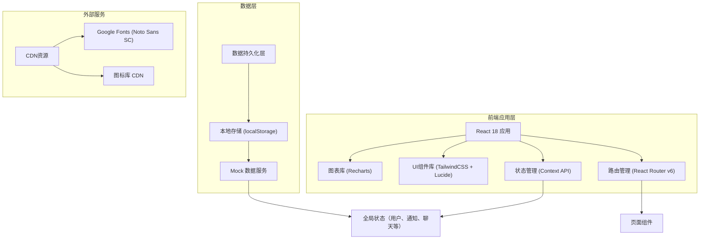

## 1. 架构设计



## 2. 技术描述

### 2.1 技术栈选择
- **前端框架**：React 18.2.0 - 组件化开发，Hooks API支持，性能优秀
- **构建工具**：Vite 5.0.0 - 快速冷启动，热更新，现代化打包
- **样式方案**：TailwindCSS 3.4.0 - 原子化CSS，快速开发，统一设计语言
- **路由管理**：React Router v6.20.0 - 声明式路由，嵌套路由支持
- **状态管理**：React Context API + useReducer - 轻量级全局状态，无需额外依赖
- **图标库**：Lucide React 0.294.0 - 统一线性风格图标
- **图表库**：Recharts 2.10.0 - React原生图表组件，支持饼图、柱状图
- **开发语言**：JavaScript (ES6+) - 降低复杂度，快速迭代

### 2.2 初始化方式
使用 Vite 官方初始化命令：
```bash
npm create vite@latest . -- --template react
```

### 2.3 后端方案
本项目采用纯前端架构，使用 localStorage 进行数据持久化，配合 Mock 数据服务模拟后端API：
- **数据存储**：localStorage 存储所有业务数据
- **数据初始化**：应用启动时检查并初始化 Mock 数据
- **数据同步**：状态变更时自动同步到 localStorage
- **模拟接口**：通过 Service 层封装数据操作，便于后续接入真实后端

## 3. 路由定义

| 路径 | 页面名称 | 权限角色 | 说明 |
|------|---------|----------|------|
| `/login` | 登录页 | 公开 | 角色选择、账号密码登录 |
| `/` | 班级主页 | 老师/家长 | 通知列表、统计概览 |
| `/notices` | 通知列表 | 老师/家长 | 所有通知展示、筛选 |
| `/notices/new` | 发布通知 | 老师 | 创建新通知 |
| `/notices/:id` | 通知详情 | 老师/家长 | 通知内容、已读状态 |
| `/leaves` | 请假管理 | 老师/家长 | 请假列表、审批/提交 |
| `/leaves/new` | 提交请假 | 家长 | 填写请假申请 |
| `/leaves/:id/approve` | 请假审批 | 老师 | 审批请假申请 |
| `/surveys` | 问卷列表 | 老师/家长 | 问卷展示、参与 |
| `/surveys/new` | 创建问卷 | 老师 | 新建家长问卷 |
| `/surveys/:id` | 问卷详情 | 老师/家长 | 填写问卷或查看统计 |
| `/surveys/:id/results` | 问卷统计 | 老师 | 回复统计和图表 |
| `/chats` | 私聊列表 | 老师/家长 | 聊天列表 |
| `/chats/:id` | 私聊窗口 | 老师/家长 | 一对一聊天界面 |
| `/students` | 学生名册 | 老师 | 学生列表、搜索筛选 |
| `/students/:id` | 学生详情 | 老师 | 学生信息、紧急联系人 |
| `/groups` | 小组管理 | 老师 | 小组列表、创建编辑 |
| `/groups/message` | 小组消息 | 老师 | 按小组发送消息 |
| `/profile` | 个人中心 | 老师/家长 | 个人信息、设置 |

## 4. API 定义（Mock 服务层）

### 4.1 类型定义

```typescript
// 用户类型
interface User {
  id: string;
  role: 'teacher' | 'parent';
  name: string;
  avatar: string;
  phone: string;
  classId?: string; // 老师所属班级
  studentIds?: string[]; // 家长关联的学生
}

// 通知类型
interface Notice {
  id: string;
  title: string;
  content: string;
  category: 'homework' | 'activity' | 'holiday' | 'other';
  authorId: string;
  classId: string;
  createdAt: string;
  attachments?: string[];
  readStatus: { parentId: string; readAt: string }[];
}

// 请假类型
interface LeaveRequest {
  id: string;
  studentId: string;
  parentId: string;
  type: 'sick' | 'personal' | 'other';
  startTime: string;
  endTime: string;
  reason: string;
  status: 'pending' | 'approved' | 'rejected';
  createdAt: string;
  approvedAt?: string;
  approverId?: string;
  approvalNote?: string;
}

// 问卷类型
interface Survey {
  id: string;
  title: string;
  description: string;
  authorId: string;
  classId: string;
  questions: SurveyQuestion[];
  deadline: string;
  createdAt: string;
  responses: SurveyResponse[];
}

interface SurveyQuestion {
  id: string;
  type: 'single' | 'multiple' | 'text';
  title: string;
  options?: string[];
  required: boolean;
}

interface SurveyResponse {
  id: string;
  parentId: string;
  answers: { questionId: string; value: string | string[] }[];
  submittedAt: string;
}

// 聊天类型
interface Chat {
  id: string;
  teacherId: string;
  parentId: string;
  studentId: string;
  messages: ChatMessage[];
  createdAt: string;
}

interface ChatMessage {
  id: string;
  senderId: string;
  content: string;
  type: 'text' | 'image' | 'file';
  createdAt: string;
  read: boolean;
}

// 学生类型
interface Student {
  id: string;
  name: string;
  gender: 'male' | 'female';
  className: string;
  studentNumber: string;
  avatar: string;
  emergencyContacts: EmergencyContact[];
  groupIds: string[];
  attendance: AttendanceRecord[];
}

interface EmergencyContact {
  name: string;
  relationship: string;
  phone: string;
}

interface AttendanceRecord {
  date: string;
  status: 'present' | 'absent' | 'late' | 'leave';
  note?: string;
}

// 小组类型
interface Group {
  id: string;
  name: string;
  classId: string;
  studentIds: string[];
  createdAt: string;
}

// 小组消息类型
interface GroupMessage {
  id: string;
  groupId: string;
  authorId: string;
  content: string;
  createdAt: string;
  readStatus: { parentId: string; readAt: string }[];
}
```

### 4.2 Mock 服务接口

| 服务方法 | 参数 | 返回值 | 说明 |
|---------|------|--------|------|
| `authService.login(role, account, password)` | role: string, account: string, password: string | Promise<User> | 模拟登录验证 |
| `authService.getCurrentUser()` | - | Promise<User \| null> | 获取当前登录用户 |
| `authService.logout()` | - | Promise<void> | 退出登录 |
| `noticeService.getNotices(classId)` | classId: string | Promise<Notice[]> | 获取班级通知列表 |
| `noticeService.getNoticeById(id)` | id: string | Promise<Notice \| null> | 获取通知详情 |
| `noticeService.createNotice(notice)` | notice: Partial<Notice> | Promise<Notice> | 创建新通知 |
| `noticeService.markAsRead(noticeId, parentId)` | noticeId: string, parentId: string | Promise<void> | 标记通知已读 |
| `leaveService.getLeaves(classId)` | classId: string | Promise<LeaveRequest[]> | 获取请假列表 |
| `leaveService.createLeave(leave)` | leave: Partial<LeaveRequest> | Promise<LeaveRequest> | 提交请假申请 |
| `leaveService.approveLeave(id, status, note)` | id: string, status: string, note?: string | Promise<LeaveRequest> | 审批请假 |
| `surveyService.getSurveys(classId)` | classId: string | Promise<Survey[]> | 获取问卷列表 |
| `surveyService.createSurvey(survey)` | survey: Partial<Survey> | Promise<Survey> | 创建问卷 |
| `surveyService.submitResponse(surveyId, response)` | surveyId: string, response: SurveyResponse | Promise<void> | 提交问卷回复 |
| `chatService.getChats(userId)` | userId: string | Promise<Chat[]> | 获取聊天列表 |
| `chatService.getChatById(id)` | id: string | Promise<Chat \| null> | 获取聊天详情 |
| `chatService.sendMessage(chatId, message)` | chatId: string, message: Partial<ChatMessage> | Promise<ChatMessage> | 发送消息 |
| `studentService.getStudents(classId)` | classId: string | Promise<Student[]> | 获取学生列表 |
| `studentService.getStudentById(id)` | id: string | Promise<Student \| null> | 获取学生详情 |
| `groupService.getGroups(classId)` | classId: string | Promise<Group[]> | 获取小组列表 |
| `groupService.createGroup(group)` | group: Partial<Group> | Promise<Group> | 创建小组 |
| `groupService.sendMessage(message)` | message: Partial<GroupMessage> | Promise<GroupMessage> | 发送小组消息 |

## 5. 数据模型

### 5.1 ER 图

```mermaid
erDiagram
    CLASS ||--o{ STUDENT : "has"
    CLASS ||--o{ TEACHER : "managed by"
    CLASS ||--o{ NOTICE : "has"
    CLASS ||--o{ SURVEY : "has"
    CLASS ||--o{ GROUP : "has"
    
    TEACHER ||--o{ NOTICE : "publishes"
    TEACHER ||--o{ SURVEY : "creates"
    TEACHER ||--o{ CHAT : "participates"
    TEACHER ||--o{ LEAVE_REQUEST : "approves"
    TEACHER ||--o{ GROUP_MESSAGE : "sends"
    
    PARENT ||--o{ STUDENT : "parent of"
    PARENT ||--o{ LEAVE_REQUEST : "submits"
    PARENT ||--o{ SURVEY_RESPONSE : "submits"
    PARENT ||--o{ CHAT : "participates"
    
    STUDENT ||--o{ LEAVE_REQUEST : "for"
    STUDENT ||--o{ ATTENDANCE_RECORD : "has"
    STUDENT }o--o{ GROUP : "belongs to"
    STUDENT ||--|| EMERGENCY_CONTACT : "has"
    STUDENT ||--o{ CHAT : "related to"
    
    NOTICE ||--o{ NOTICE_READ_STATUS : "has"
    NOTICE_READ_STATUS }o--|| PARENT : "by"
    
    SURVEY ||--|{ SURVEY_QUESTION : "has"
    SURVEY ||--o{ SURVEY_RESPONSE : "has"
    SURVEY_RESPONSE ||--|{ SURVEY_ANSWER : "has"
    
    CHAT ||--|{ CHAT_MESSAGE : "contains"
    
    GROUP ||--o{ GROUP_MESSAGE : "has"
    
    TEACHER {
        string id PK
        string name
        string phone
        string avatar
        string classId FK
    }
    
    PARENT {
        string id PK
        string name
        string phone
        string avatar
    }
    
    STUDENT {
        string id PK
        string name
        string gender
        string studentNumber
        string classId FK
        string avatar
    }
    
    EMERGENCY_CONTACT {
        string id PK
        string studentId FK
        string name
        string relationship
        string phone
    }
    
    CLASS {
        string id PK
        string name
        string grade
    }
    
    NOTICE {
        string id PK
        string title
        string content
        string category
        string authorId FK
        string classId FK
        datetime createdAt
    }
    
    NOTICE_READ_STATUS {
        string id PK
        string noticeId FK
        string parentId FK
        datetime readAt
    }
    
    LEAVE_REQUEST {
        string id PK
        string studentId FK
        string parentId FK
        string type
        datetime startTime
        datetime endTime
        string reason
        string status
        datetime createdAt
    }
    
    SURVEY {
        string id PK
        string title
        string description
        string authorId FK
        string classId FK
        datetime deadline
        datetime createdAt
    }
    
    SURVEY_QUESTION {
        string id PK
        string surveyId FK
        string type
        string title
        string options
        boolean required
    }
    
    SURVEY_RESPONSE {
        string id PK
        string surveyId FK
        string parentId FK
        datetime submittedAt
    }
    
    CHAT {
        string id PK
        string teacherId FK
        string parentId FK
        string studentId FK
        datetime createdAt
    }
    
    CHAT_MESSAGE {
        string id PK
        string chatId FK
        string senderId FK
        string content
        string type
        datetime createdAt
        boolean read
    }
    
    GROUP {
        string id PK
        string name
        string classId FK
        datetime createdAt
    }
    
    GROUP_MESSAGE {
        string id PK
        string groupId FK
        string authorId FK
        string content
        datetime createdAt
    }
    
    ATTENDANCE_RECORD {
        string id PK
        string studentId FK
        date date
        string status
        string note
    }
```

### 5.2 数据初始化脚本

应用启动时将自动执行以下数据初始化（Mock 数据）：

```javascript
// 初始化班级
const defaultClass = {
  id: 'class-001',
  name: '三年级(2)班',
  grade: '三年级'
};

// 初始化老师账号
const defaultTeacher = {
  id: 'teacher-001',
  role: 'teacher',
  name: '王老师',
  avatar: 'https://api.dicebear.com/7.x/avataaars/svg?seed=teacher',
  phone: '13800138000',
  classId: 'class-001',
  account: 'teacher',
  password: '123456'
};

// 初始化家长账号（2位家长用于演示）
const defaultParents = [
  {
    id: 'parent-001',
    role: 'parent',
    name: '张伟妈妈',
    avatar: 'https://api.dicebear.com/7.x/avataaars/svg?seed=parent1',
    phone: '13900139001',
    studentIds: ['student-001'],
    account: 'parent1',
    password: '123456'
  },
  {
    id: 'parent-002',
    role: 'parent',
    name: '李娜爸爸',
    avatar: 'https://api.dicebear.com/7.x/avataaars/svg?seed=parent2',
    phone: '13900139002',
    studentIds: ['student-002'],
    account: 'parent2',
    password: '123456'
  }
];

// 初始化学生（10位学生）
const defaultStudents = [
  { id: 'student-001', name: '张伟', gender: 'male', studentNumber: '2023001', ... },
  { id: 'student-002', name: '李娜', gender: 'female', studentNumber: '2023002', ... },
  // ... 更多学生
];

// 初始化示例通知、请假、问卷、聊天记录等
```

## 6. 项目目录结构

```
src/
├── assets/              # 静态资源
│   └── styles/          # 全局样式
│       └── index.css    # TailwindCSS 入口 + 自定义样式
├── components/          # 通用组件
│   ├── Layout/          # 布局组件
│   │   ├── Sidebar.jsx  # 侧边导航栏
│   │   ├── Header.jsx   # 顶部导航
│   │   └── PageContainer.jsx
│   ├── common/          # 基础组件
│   │   ├── Button.jsx
│   │   ├── Card.jsx
│   │   ├── Input.jsx
│   │   ├── Modal.jsx
│   │   ├── Badge.jsx
│   │   └── Avatar.jsx
│   └── features/        # 业务组件
│       ├── NoticeCard.jsx
│       ├── LeaveCard.jsx
│       ├── SurveyCard.jsx
│       ├── ChatBubble.jsx
│       ├── StudentCard.jsx
│       └── GroupCard.jsx
├── contexts/            # 全局状态
│   ├── AuthContext.jsx
│   ├── NoticeContext.jsx
│   ├── ChatContext.jsx
│   └── DataContext.jsx
├── pages/               # 页面组件
│   ├── Login.jsx
│   ├── Home.jsx
│   ├── NoticeList.jsx
│   ├── NoticeDetail.jsx
│   ├── NoticeNew.jsx
│   ├── LeaveList.jsx
│   ├── LeaveNew.jsx
│   ├── LeaveApprove.jsx
│   ├── SurveyList.jsx
│   ├── SurveyNew.jsx
│   ├── SurveyDetail.jsx
│   ├── SurveyResults.jsx
│   ├── ChatList.jsx
│   ├── ChatWindow.jsx
│   ├── StudentList.jsx
│   ├── StudentDetail.jsx
│   ├── GroupList.jsx
│   ├── GroupMessage.jsx
│   └── Profile.jsx
├── services/            # 数据服务层
│   ├── mockData.js      # Mock 数据
│   ├── storage.js       # localStorage 封装
│   ├── authService.js
│   ├── noticeService.js
│   ├── leaveService.js
│   ├── surveyService.js
│   ├── chatService.js
│   ├── studentService.js
│   └── groupService.js
├── utils/               # 工具函数
│   ├── date.js          # 日期处理
│   ├── format.js        # 格式化工具
│   └── constants.js     # 常量定义
├── App.jsx              # 根组件
├── main.jsx             # 入口文件
└── router.jsx           # 路由配置
```
